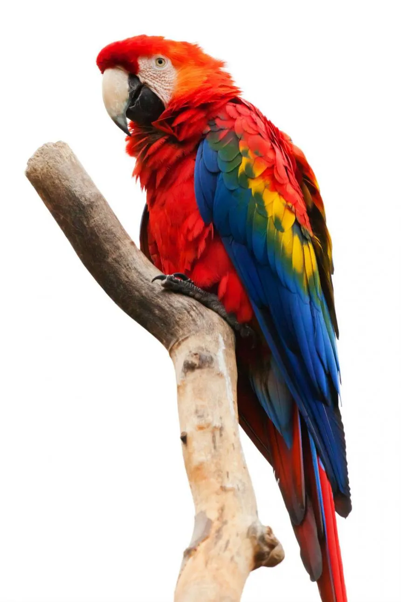
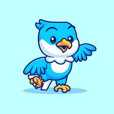
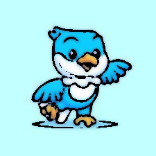

# Cartoon_Rendering
## 만화 같은 느낌이 잘 표현되지 않은 이미지 
 
## 만화 같은 느낌이 잘 표현된 이미지
 
## 알고리즘의 한계점과 이미지의 차이점
첫번째 이미지는 날개와 같이 선이 새밀하고 빼곡한 경우 이미지에 알고리즘을 적용시켰을때 해당 부분이 재대로 표현되지 않았다. 
그에 반해 두번째 이미지는 대부분 굵고 단순한 선으로 구성되어 좀 더 만화같은 느낌이 더 잘 표현된것 같다.
